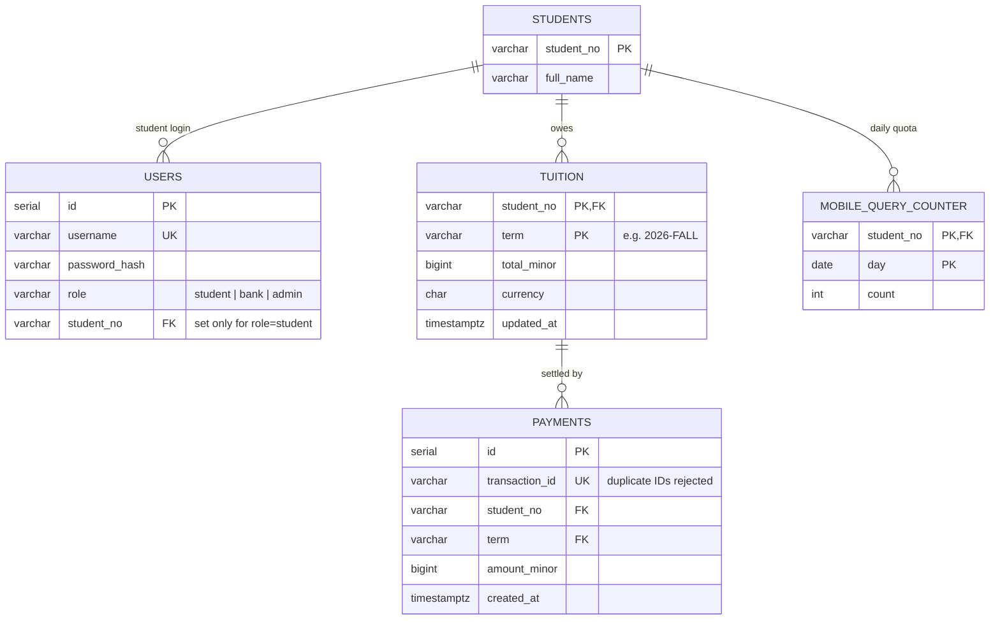

# ER / Data Model

```mermaid
erDiagram
    STUDENTS ||--o{ USERS : "student login"
    STUDENTS ||--o{ TUITION : "owes"
    TUITION  ||--o{ PAYMENTS : "settled by"
    STUDENTS ||--o{ MOBILE_QUERY_COUNTER : "daily quota"

    STUDENTS {
        varchar student_no PK
        varchar full_name
    }
    USERS {
        serial id PK
        varchar username UK
        varchar password_hash
        varchar role "student | bank | admin"
        varchar student_no FK "set only for role=student"
    }
    TUITION {
        varchar student_no PK,FK
        varchar term PK "e.g. 2026-FALL"
        bigint total_minor
        char currency
        timestamptz updated_at
    }
    PAYMENTS {
        serial id PK
        varchar transaction_id UK "duplicate IDs rejected"
        varchar student_no FK
        varchar term FK
        bigint amount_minor
        timestamptz created_at
    }
    MOBILE_QUERY_COUNTER {
        varchar student_no PK,FK
        date day PK
        int count
    }
```

Balance is derived: `balance = tuition.total_minor - SUM(payments.amount_minor)` for the (student, term).
